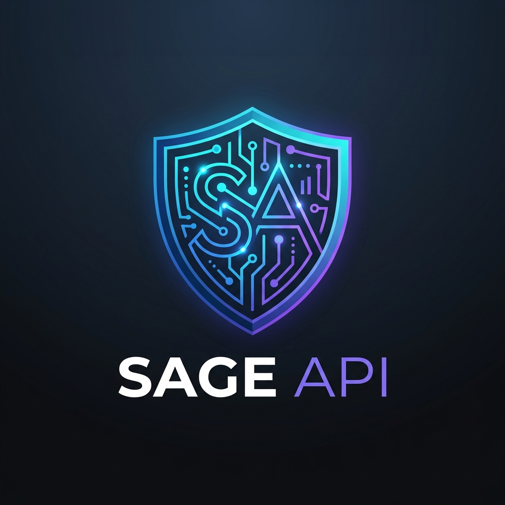
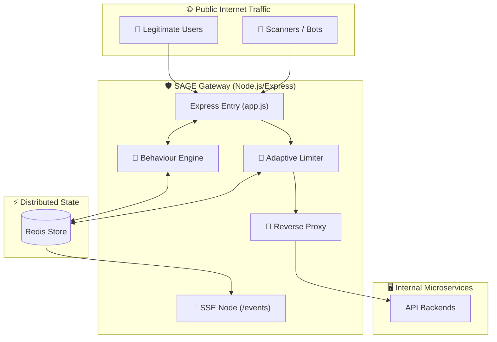
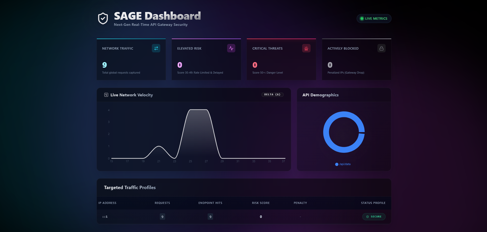

<div align="center">



# SAGE API Gateway
**S**ecurity • **A**nalytics • **G**ateway • **E**ngine

*A lightweight, real‑time Node.js API gateway that intelligently detects, scores, and mitigates malicious traffic before it ever touches your vulnerable backend services.*

[](https://nodejs.org)
[](https://expressjs.com)
[](https://react.dev)
[](https://redis.io)
[](LICENSE)

---
</div>

## 📖 Table of Contents
- [Overview](#-overview)
- [Core Features](#-core-features)
- [Architecture & Workflow](#-architecture--workflow)
- [Project Structure](#-project-structure)
- [Getting Started](#-getting-started)
- [Monitoring Dashboard](#-monitoring-dashboard)
- [Security Engine Deep-Dive](#-security-engine-deep-dive)
- [Tech Stack](#-tech-stack)
- [Contributing](#-contributing)
- [License](#-license)

## 📖 Overview

SAGE stands fundamentally between the **public internet and your private APIs**. It inspects every incoming HTTP request, calculates a dynamic **Risk Score** using its internal Behaviour Engine, and immediately enforces adaptive network defenses such as artificial traffic shaping, IP-banning, and tiered rate limiting. It pushes all network telemetry via Server-Sent Events (SSE) to a premium React-based dashboard.

---

## ✨ Core Features

| Feature | Description |
|:---|:---|
| 🧠 **Behaviour Engine** | Dynamically calculates per‑IP risk based on request velocity, route enumeration anomalies, header signatures, and historical penalty caches. |
| 🚧 **Multi‑Tier Rate Limiting** | Implements a robust global limiter combined with tiered limits (e.g., 20/min for low risk vs. 5/min for medium risk) backed continuously by Redis. |
| 🐢 **Traffic Shaping** | Intentionally injects artificial delays (e.g., 500 ms) for medium‑risk traffic to systematically break brute force systems and automated vulnerability scanners. |
| 🚔 **Dynamic Penalty System** | Utilizes an intelligent IP‑level Access Control List (ACL) that automatically escalates block durations for repeat offenders. |
| 📊 **Real‑Time Analytics** | Streams instant telemetry (live charts, endpoint hits, active IP tables) natively to its frontend through lightweight SSE pipelines. |
| 💎 **Glass-morphic Dashboard** | Includes an integrated, dark-themed React UI featuring premium micro-animations and granular network visibility. |

---

## 🏗 Architecture & Workflow

SAGE evaluates connections linearly to ensure minimal latency for legitimate traffic.

### 1. The Request Lifecycle
1. **Ingress** – The Express pipeline catches the inbound request. SAGE bypasses system routes (like web assets or the SSE stream).
2. **Behaviour Engine Analysis** – 
   - Tracks `req:IP` counters and `endpoint:IP` counts within Redis windows.
   - Sniffs `User-Agent` telemetry.
   - Evaluates historical `penalty:IP` keys.
   - Returns a numeric **Risk Score (0-100)**.
3. **Verdict Matrix** –
   - **≥ 50 (High Risk):** Instant `403 Forbidden` response. Persistent penalty counter increased.
   - **30‑49 (Medium Risk):** Enacts Traffic Shaping (500ms slowdown) and applies a **Strict Rate Limiter**.
   - **< 30 (Low Risk):** Normal API functionality under the generic rate limiter.
4. **Proxy Stage** – Validated requests are securely proxied forward to backend microservices.
5. **SSE Broadcast** – Background loops scan Redis and pipe JSON statistics to `/events` for the Dashboard.

### 2. Topology



---

## 📂 Project Structure

A monolithic multi-package configuration making setup extremely easy.

```text
SAGE_API/
│
├── app.js                 # Gateway entry point & SSE broadcast
├── backend.js             # Mock target server for testing
├── package.json           # Root dependencies & concurrent dev script
│
├── config/
│   └── redis.js           # Distributed Redis connectivity
│
├── gateway/
│   ├── behaviour.js       # SAGE analytical risk-engine
│   ├── rateLimiter.js     # Tiered consumption logic 
│   └── proxy.js           # Traffic forwarding middleware
│
├── frontend/              # SAGE Monitoring Station (React + Vite)
│   ├── src/
│   ├── index.html
│   └── package.json       
│
└── docs/                  # Assets (Logos, Screenshots)
```

---

## 🚀 Getting Started

### Prerequisites
Before spinning up the gateway, guarantee your operational environment possesses the following:
* **Node.js** (v18.x or newer)
* **Redis Instance** (Available at `redis://127.0.0.1:6379`)

### Installation & Initialization

1. **Clone SAGE**
   ```bash
   git clone https://github.com/Ujjwalsen/SAGE_API.git
   cd SAGE_API
   ```

2. **Install Component Environments**
   ```bash
   # Install root server packages
   npm install

   # Install the React Dashboard
   cd frontend
   npm install
   cd ..
   ```

3. **Establish Configuration**
   Populate a primary `.env` file in the root context.
   ```env
   PORT=3000
   TARGET_URL=http://localhost:4000
   REDIS_URL=redis://127.0.0.1:6379
   ```

4. **Ignition**
   Launch SAGE. We utilize `concurrently` to spin up the Gateway, Mock Backend, and React Dashboard universally!
   ```bash
   npm run dev
   ```

| Microservice | Internal Port | URL |
|:---|:---|:---|
| **API Gateway** | `3000` | `http://localhost:3000` |
| **Backend Pool** | `4000` | Mock Destination Internal Only |
| **SAGE Dashboard** | `5173` | `http://localhost:5173` |

5. **Generate Simulated Traffic**
   Open a separate shell and trigger our included simulation tool to witness the Behaviour Engine in action.
   ```bash
   node test_traffic.js
   ```

---

## 📊 Monitoring Dashboard

Once the ecosystem initiates, access `http://localhost:5173` to view the comprehensive glass-morphic command center.

<p align="center">
  
</p>

* **Network Velocities**: Area charts rendering traffic density metrics.
* **API Demographics**: Component analytics showcasing which endpoints are active.
* **Active Threat Tracking**: Datatables indicating precise IP identities, assigned risk scores, active penalties, and proxying statuses.

---

## 🧠 Security Engine Deep-Dive

For those customizing SAGE, understanding the mathematical heuristics is necessary. SAGE generates dynamic scores leveraging temporal context.

**Heuristic Computation (`gateway/behaviour.js`)**
```javascript
let riskScore = baselinePenalty; // Historic state penalty

// Volume Anomaly
if (requestRate > 20) riskScore += 10;
if (requestRate > 40) riskScore += 20;

// Enumeration / Brute-force Tracking
if (endpointFocusCount > 15) riskScore += 10;
if (endpointFocusCount > 30) riskScore += 20;

// Explicit Footprints
if (headers['user-agent'].includes('curl')) riskScore += 10;
```

**Consequences Matrix**
| Output Range | Status | Action Enforced |
|:---:|:---|:---|
| **0 - 29** | ✅ Approved | Sent to `normalLimiter` (20 req/min). |
| **30 - 49** | ⚠️ Suspicious | Enacts `strictLimiter` (5 req/min) & `500ms` Traffic Delays. |
| **> 50** | 🚨 High Risk | Permanent TCP block via `403`. Logs +10 Penalty Points to Redis to penalize future encounters from IP. |

---

## 🛠 Tech Stack Overview

Built efficiently on modern, open technologies.

| Category | Technology |
|:---|:---|
| **Gateway Runtime** | [Node.js](https://nodejs.org/) & [Express 5](https://expressjs.com/) |
| **Distributed Memory** | [Redis](https://redis.io/) via `ioredis` |
| **Defensive Middleware** | [Helmet](https://helmetjs.github.io/), `rate-limiter-flexible` |
| **Routing / Proxying** | `http-proxy-middleware` |
| **Dashboard Framework** | [React 18](https://react.dev/), [Vite](https://vitejs.dev/) |
| **Design Language** | [Tailwind CSS](https://tailwindcss.com/) & [shadcn/ui](https://ui.shadcn.com/) |
| **Observability** | [morgan](https://github.com/expressjs/morgan), Server-Sent Events (SSE) |

---

## 🤝 Contributing

We strongly encourage engineering contributions—especially regarding new signature detections for the Behaviour Engine or advanced Redis clusters!

1. Fork SAGE
2. Branch your feature (`git checkout -b feature/advanced-shielding`)
3. Commit cleanly (`git commit -m "feat: Include TLS handshaking logs"`)
4. Open a Pull Request!

---

## 📄 License

SAGE is completely Free and Open Source under the **ISC License**. 
Build safer networks together.

<p align="center">
<b>Built with security in mind. SAGE API Gateway © 2026</b>
</p>
